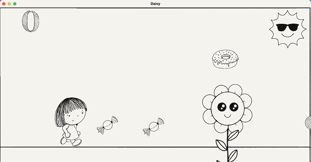

# Daisy Game in Java
The objective of this game is to help a little girl named Daisy collect her candies. This game was implemented in Java and utilizes the Model-View-Controller design pattern to connect the various elements. The Java Graphics Library was included to draw the visual components to the screen. Inheritance and Polymorphism organize and support the functionality of the game. There are also mouse and keyboard events to aid the user in navigating the application seamlessly. 

Below is a demo of the game.

